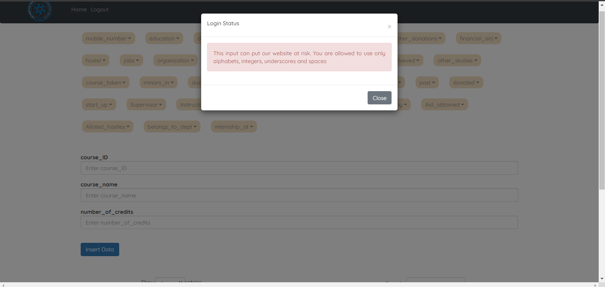
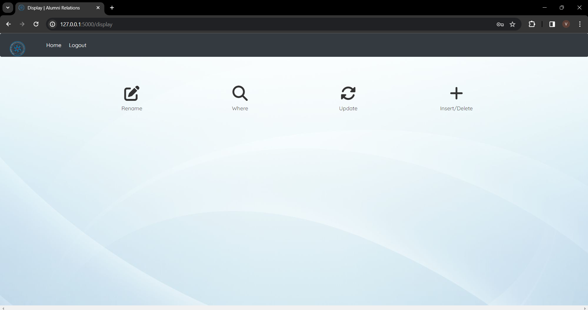
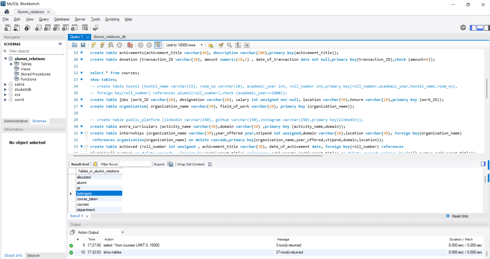

# Alumni-Relations-Database
This repository contains the source code for all Assignment 3 of the Databases (CS 432) course by Prof. Mayank Singh.
The goal is to develop a DBMS using Flask and MySQl

## Getting Started

To set up the environment to run the assignment codes follow the below steps:

- You must have [Python](https://www.python.org/) and pip installed on your laptop/desktop. Run the following commands to check the whether you have them installed or not.
```
python --version
pip --version
```

- Install the packages from requirements.txt
```
pip install -r requirements.txt
```

- You must also have MySQL Workbench installed on your laptop/desktop.
## Creating and opening virtual environment

```
pip install virtualenv
python3 -m venv myenv
``` 
For macOS and linux:
```
source myvenv/bin/activate
```
For Windows:
```
myenv\Scripts\activate
```
## Running the Web App

In order to run the Web App you can run the following command in your terminal or run main.py file

- Run main.py file 
```
python main.py
```
<br>


<br>
- Open the link for the Web Server present in your terminal or you can copy the following link:
```
http://127.0.0.1:5000/
```

<br>
- The link will direct you to Home page of our WebApp. Click the login button will direct you to our login page.
# Assignment 4 README
## Responsibilities of G1
### Updates from feedback
### 1. User UI made understandable and easy to search with more restricted views

#### Before first feedback

#### After final feedback

- User can select by what option they want to search and search making it easy for the user than prior where we have to go to the tables to get the information which maynot be understandable by all the users.
<br>


- Here is one example of search by graduation year where all the alumni graduated in 2008 were displayed.
### 2. User will be able to update his personal info

#### Before first feedback

#### After final feedback

- Before first review the user was not given the credibility to update their personal details which was updated later.
### 3. Nameing the tables better
#### Before first feedback

#### After final feedback

<br>
- The tables were given meaningful and easy to understand names than that of before.
<br>

### Privileges
### Admin privileges
- If you login as admin you will be given access to all the tables and you can perform Rename, where, update, insert and Delete functions. Basically total access is present wiht the admin.


### All the UI and backend remains the same from that of the last assignment as that was satisfactory for the stakeholders.

### User privileges
- If you login as user you will be able to edit some of your personal information which doesnot need authentication of anykind. They will not be allowed to change their information which requires authentication and cannot change any type of information of other users.


- The user will be able to access the required information such as alumni graduated in 2008 etc easily than before and will be restricted only to see limited amount of data which is not considered confidential. Remaining information is locked. He/she cannot do CRUD operations.


## Responsibilities of G2
### Concurrent multi-user access
-Used the following commands to lock the table while updating, renaming, deleting and unlocked as soon as the work is done.
```
cursor.execute(f"LOCK TABLES {table_name} WRITE")
cursor.execute(f"UNLOCK TABLES")
``` 

### Google authentication for login and signup
- Used google authentication for login and signup and access to the website is given only to IITGN mail accounts.


<br>

<br>

<br>
- If the gmail account used is other than from that of IITGN the access is restricted.
<br>


## Responsibilities of G1 and  G2

### Attacks 
#### XSS Attack
-XSS attack can be done when the user is allowed to enter HTML tags in the input.
-To prevent this attack from happening we restricted the input to not take HTML tags.
<br>
Here we are  giving a HTML tag as input.
<br>

<br>
There will be a popout saying that is not allowed. Hence in this way XSS atack can be prevented.
<br>

<br>
#### SQL Injection
-SQL injection can be done by manupulating the input using "" or '' or any other MYSQL key words and changing the query itself.
<br>
Before adding protection if the input 2008 OR 1 = 1 input is given in search by graduation year option it selects all the entries in the database showing vulnerability to SQL injection 
<br>

<br>
After using Re library in python to not accept the MYSQL key words if we search for the same an error occurs showing the website is protected. 
<br>

<br>

<br>


# Work Distribution
### Reddybathuni Venkat:
Worked on backend routes for google authentication and new user features.<br>
Managed google cloud OAuth 2.0 Client ID's.<br>
Worked on preventing XSS and sql injection attacks in the backend<br>
Worked on github management
<br>
### Naga Bhuvith Nakka:
Worked on Concurrent multi-user access<br>
Worked on backend for new user features.<br>
Took feedback from stakeholders.
<br>
### Kaila Uday Vardhan Reddy:
Contributed to front end for updates after feedback..<br>
Worked on some part of the combined work of G1&G2.<br>
Took feedback from stakeholders.
<br>
### Koleti Eswar Sai Ganesh:
Helped in fixing some errors.<br>
Assisted with integrating Flask with Google.<br>
Also helped in debugging errors in backend.
<br>
### Chakradhar Basani:
Helped in the documentation and worked on the README file.<br>
Also helped in debugging errors during testing.<br>
Worked on attacks in flask
<br>
### Vubbani Bharath Chandra: 
Tested and ran the web application.<br>
Also clicked screenshots of successful executions.<br>
Also helped in fixing & debugging errors.
<br> 

# Assignment 3 README
## User Login 
<br>


- You can login as existing user if you already have an account or you can Sign Up by selecting the Sign up button in the navigation bar. (By signing up your details are going to get stored in the users table of our database)
<br>


- Upon successfull login or signup we get user profile page as shown
<br>


- On the navbar we can see view tables which redirects us to the following page where we can only view certain number of tables as we were logged in as user. All the CRUD operations are restricted for user login.
<br>

<br>

## Admin Login

- You can also Login as Admin. In the navigation bar select Admin Login. In the login form enter the following credentials for login.

```
Email: admin@iitgn.ac.in
Password: 123456789
```

- Once you have logged in successfully. The Display page will appear in which you can view , insert/delete, update, rename, where options.


Below are the screenshots of successfully executed queries in the database:

## Insert
<br>
As you can see from the picture that we are able to insert data in the table using our Web App.
<br>


<br>
<br>

## Update 
<br>
The figure shows successful running of the update query. We are able to update data present in the table.
<br>


<br>
<br>

## Delete
<br>
We have implemented a delete button in front of every row of table. It allows us to delete a particular row of the selected table. 
<br>


<br>
<br>

## Rename
<br>
By selecting rename in the display page it then redirects to another page in which you can change the name of table present.
<br>
We are renaming belongs_to page to belongsto
<br>



<br>
<br>

## Where
<br>
By clicking on the where option in display page, you are redirected to a different page in which you can provide the field name and value for implementing the where query.
<br>


<br>
## Work Distribution
# Reddybathuni Venkat:
Worked on backend routes.<br>
Worked on Flash integration and integrating database in a web app using MySQL.<br>
Contributed to the creation of HTML pages that are displayed on the web application.<br>
Worked on github management
<br>
# Naga Bhuvith Nakka:
Helped in integrating database in a web app using MySQL.<br>
Developed an idea for the Front-end.<br>
Also worked on the UPDATE function and helped on the backend part.
<br>
# Kaila Uday Vardhan Reddy:
Worked on the Front-end of the Web app using HTML.<br>
Worked on some part of the combined work of G1&G2.<br>
Contributed to the Front-end development of these HTML pages using CSS.
<br>
# Koleti Eswar Sai Ganesh:
Helped in fixing some errors.<br>
Assisted with integrating Flask with MySQL.<br>
Also worked on the backend part (Delete function).
<br>
# Chakradhar Basani:
Helped in the documentation and worked on the README file.<br>
Taken screenshots.<br>
Also helped in debugging errors during testing.<br>
Worked on authentication in flask
<br>
# Vubbani Bharath Chandra: 
Tested and ran the web application.<br>
Also clicked screenshots of successful executions.<br>
Also helped in fixing & debugging errors.
<br> 
# Sai Charan Miriyala:
Entered some dummy values and showed these dummy entries on the web page.<br>
Established necessary connections to thoroughly test both our database and the web application.<br>
Contributed to the Front-end development of these HTML pages using CSS.<br>

